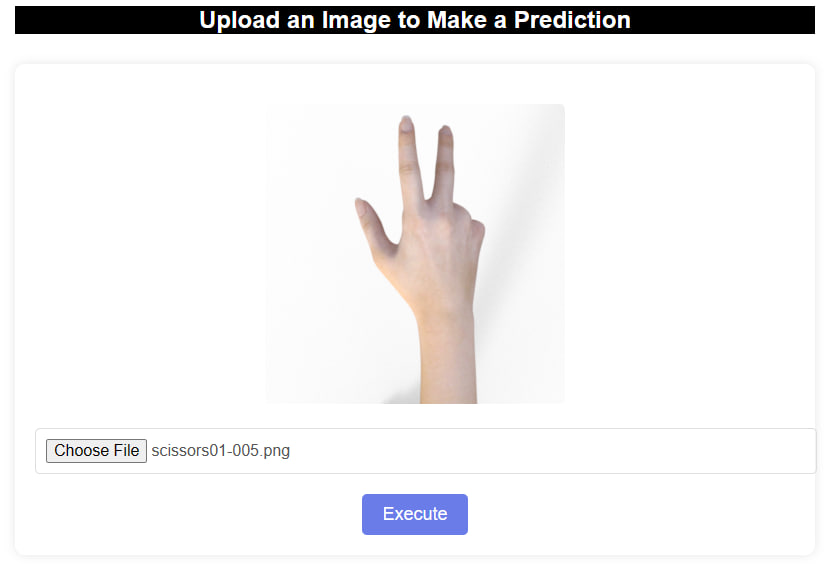
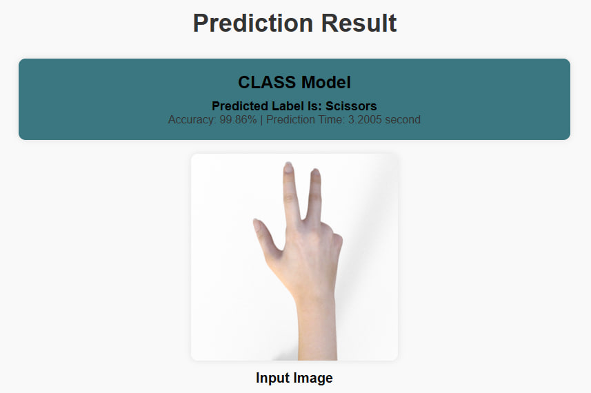
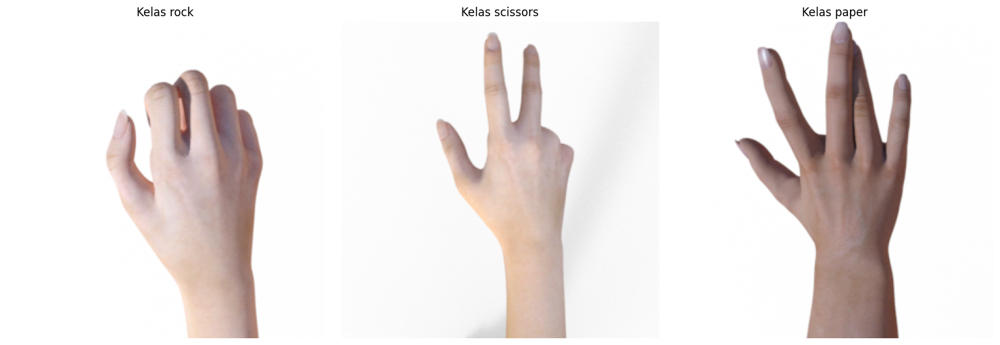

# UAP-Ivon-Viqro-Dini

## Author
- Ivon Viqro Dini


# Rock-Paper-Scissors Simple Prediction App




A simple web application that uses a pre-trained deep learning model to predict whether an uploaded image contains a rock, paper, or scissors.

## Table of Contents
1. [Introduction](#introduction)
2. [Features](#features)
3. [Dataset](#dataset)
4. [Requirements](#requirements)
5. [How to Use](#how-to-use)
6. [Contributing](#contributing)
7. [Author](#author)

## Introduction

This web application is designed to make predictions on images using a pre-trained model for the Rock-Paper-Scissors game. Users can upload an image, and the application will provide a prediction along with the confidence scores for each class.

## Features

- Image upload for prediction.
- Display of predicted class and confidence scores.
- Simple and user-friendly interface.

## Dataset
This dataset comprises 2520 images categorized into three classes: paper, rock, and scissors. Each class contains 840 images. [You can access the dataset through the following](https://drive.google.com/drive/folders/1--SInWqD-WLF8I5LLGxZs9Y6p83tPmvN?usp=sharing).





## Requirements

- Python 3
- Flask
- OpenCV
- NumPy
- TensorFlow
- Pillow

Install the dependencies using the following command:

```bash
pip install -r requirements.txt
```
## How-to-Use

Create virtual evironment
```bash
conda create -n myenv python=3
conda activate myenv
```
Here's the command to run the program in the terminal using Flask:
```bash
flask run
```
## Contributing


This simple program serves as an exemplary reference for users, providing a foundation for further exploration or as a stepping stone for more advanced research that could yield more sophisticated products. The code's simplicity makes it accessible for users to understand its basic structure and functionality, potentially inspiring them to extend its capabilities or integrate it into more complex applications. Whether used as a learning tool, a reference point, or the starting point for advanced research, this program offers versatility and adaptability to cater to diverse user needs in the realm of software development.

